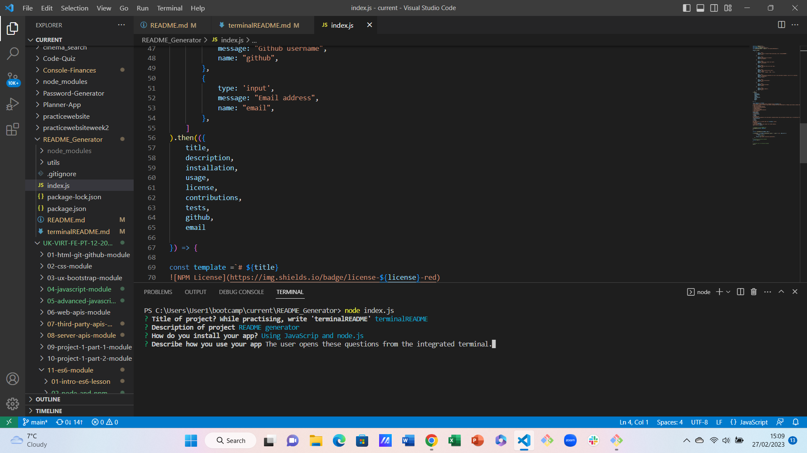

# README_Generator
Week 11 Challenge Working with ES6 and Node.js

[]

## Description
I wanted to create a README.md generator using ES6 and Node.js.
The app enables the user to create a README very quickly by using prompt questions and using node.js to render those questions to a newly created, or updated, README file.
I learned how to use Node.js, fs, inquirer, and I learned more about md syntax as well as more about content expected of a README.

## Installation
The app is run from within the JavaScript file. The user should open the integrated terminal and use the command 'node index.js' or simply 'node index'.
There are no other installation requirements.

## Usage
When the user enters 'node index.js' a series of prompt questions is displayed on screen in the integrated terminal.
A screenshot is provided of how this works:

Once the user has completed answering all the questions, the README.md file is automatically generated.
While constructing the app, and for the purposes of distinguishing between README files, this README.md is the actual README.md for this app; any generated by the terminal while using the app, for practice purposes, have been named 'terminalREADME'. This wording is suggested in the JavaScript file, but would be removed if this app were to be deployed.
The terminalREADME should be correctly formatted and correctly generated by the content that the user inputted into node index.js

## License
I selected the MIT license for this app.

## Badges
Two badges have been added, one for the contributor covenant, the other for the MIT license.

## How to Contribute
Other developers are welcome to contribute. For both this and the generated README, I have included the Contributor Covenant.

Developers wishing to report problems can email me on philculling@hotmail.com.
 

Phil's to-do list

Do the video! Clear all previous content first. Make sure this page is NOT showing, just a page you want to be showing is showing!

Check assignment requirements one final time.

Insert link to the video into the proper README.

Get rid of these notes, do final commit.
    
